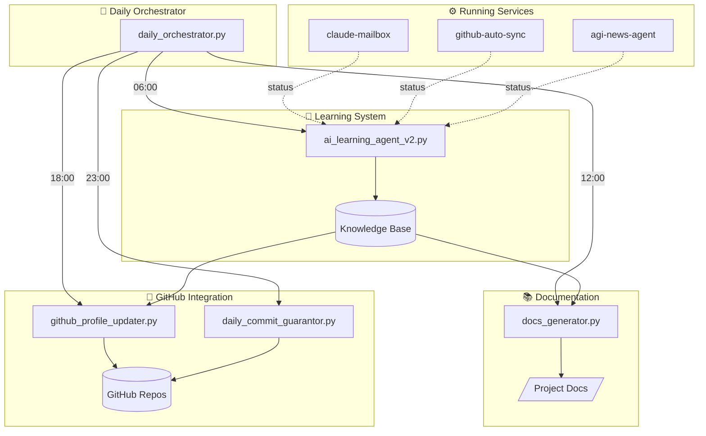

# 🤖 VM Auto-Deployer

Autonomous AI system for Oracle Cloud VMs - self-learning, auto-documenting, and ensuring daily GitHub activity.

## 🏗️ System Architecture



## 📊 Components

| Component | Purpose | Schedule |
|-----------|---------|----------|
| `ai_learning_agent_v2.py` | Learn from internal projects | 06:00 daily |
| `docs_generator.py` | Auto-generate documentation | 12:00 daily |
| `github_profile_updater.py` | Update GitHub profile | 18:00 daily |
| `daily_commit_guarantor.py` | Ensure green squares | 23:00 daily |
| `daily_orchestrator.py` | Coordinate all systems | Controls all |

## 🚀 Quick Start

```bash
# Check system status
python3 daily_orchestrator.py status

# Run morning learning cycle
python3 daily_orchestrator.py morning

# Run full cycle (all systems)
python3 daily_orchestrator.py full
```

## 📈 Current Statistics

- **Projects Analyzed:** 9+
- **Functions Discovered:** 179+
- **Classes Found:** 10+
- **Services Running:** 2/3

## 🔄 Automated Timers

```bash
# View active timers
systemctl list-timers | grep orchestrator

# Manual trigger
sudo systemctl start orchestrator-morning.service
```

## 📁 File Structure

```
auto-deployer/
├── daily_orchestrator.py      # Main coordinator
├── ai_learning_agent_v2.py    # Internal learning
├── docs_generator.py          # Documentation generator
├── github_profile_updater.py  # Profile updater
├── daily_commit_guarantor.py  # Green squares
├── change_tracker.py          # Git change tracker
├── auto_commit.sh             # Auto-commit script
└── daily_stats.json           # Daily statistics
```

## 🔒 Security

- API keys managed via `~/.keys/key_manager.py`
- No secrets in repository
- Environment variables for sensitive data

---

*🤖 Auto-generated and maintained by AI agents*
